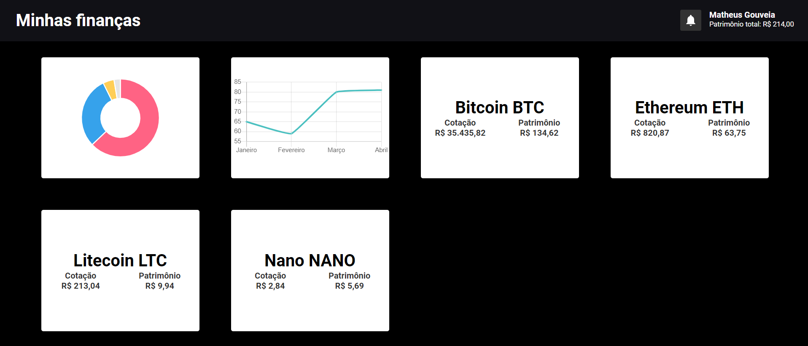

# Minhas finanças

Minhas finanças é um dashboard para acompanhamento de investimentos de todos os tipos, atualmente apenas calcula o valor do
patrimônio atual com base em dados estáticos.

Em breve será possível fazer o lançamento das aplicações diretamente no aplicativo que mostrará as flutuações do mercado em tempo real.

Posteriormente será feita a integração com outras API's, como a da B3 para ações, fundos de investimentos, FII's e renda fixa.

## TO - DO

-   Criar backend para armazenar os dados

-   Cadastro de usuário

-   Lançar novos investimentos

-   Rendimento desde a aplicação

-   Integração com a b3
